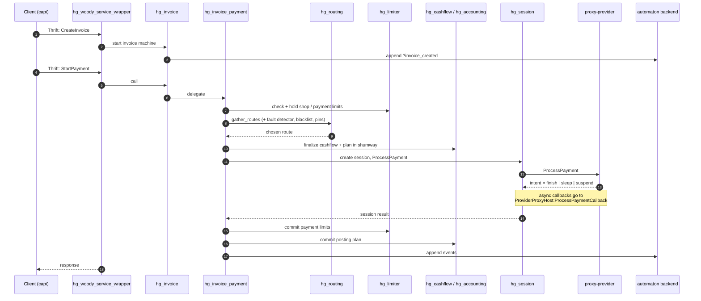

# Architecture overview

## What Hellgate is

Hellgate (sometimes referred to as *payment processing* or the *processing
core*) is the service that owns the business-logic view of every invoice and
payment in the platform. Everything that happens to money — creating an
invoice, authorising a card, capturing a hold, paying out after settlement,
refunding, charging back, re-trying against a different provider — is a
transition on a Hellgate state machine.

Hellgate is intentionally *not* an API gateway: it is invoked by the
customer-facing API (capi/capi-pcidss and similar) over Woody/Thrift, and it
consumes a set of backend services in turn. It is the source of truth for the
*state* of each invoice and payment; balances live in the accounter (shumway)
and provider-side data lives on the providers.

## OTP applications

The release is composed of five OTP applications under
[`apps/`](../apps):

| Application        | Responsibility |
| ------------------ | -------------- |
| `hellgate`         | All business logic: state machines, sessions, routing hooks, limits, accounting, risk, repair, invoice templates. |
| `hg_proto`         | Thrift service definitions, Woody service wrapper, protocol helpers. This is the module that mounts the Woody servers and marshals/unmarshals Thrift terms. |
| `hg_client`        | Woody client for the public invoicing and invoice-templating APIs. Used from tests and ad-hoc tooling. |
| `hg_progressor`    | Progressor (the newer event-sourced automaton backend) integration: wraps Progressor RPC, encodes/decodes events, propagates OpenTelemetry context, and exposes a `Processor` callback that Progressor invokes to run Hellgate machines. |
| `routing`          | Routing logic as a standalone app: candidate gathering, scoring, rejection tracking, route explanations. The `hellgate` app calls into it but keeps no routing state itself. |

## External services

Hellgate is one piece of a wider microservice ecosystem. The dependencies it
consumes are shown below with the Hellgate module that wraps each one:

| Service           | Purpose                                                   | Wrapper module |
| ----------------- | --------------------------------------------------------- | -------------- |
| DMT (`dmt_client`) | Versioned domain configuration (providers, terminals, proxies, payment institutions, routing rules, fees, limits, categories, currencies). Every domain lookup in Hellgate goes through `hg_domain`. | [hg_domain.erl](../apps/hellgate/src/hg_domain.erl) |
| party-management   | Party/shop configuration, operability, contracts.        | [hg_party.erl](../apps/hellgate/src/hg_party.erl) |
| limiter / liminator | Turnover limit enforcement (`Get`, `Hold`, `Commit`, `Rollback`). | [hg_limiter.erl](../apps/hellgate/src/hg_limiter.erl), [hg_limiter_client.erl](../apps/hellgate/src/hg_limiter_client.erl) |
| shumway (accounter)| Double-entry accounting. Hellgate submits and commits posting plans. | [hg_accounting.erl](../apps/hellgate/src/hg_accounting.erl) |
| bender            | Deterministic ID generation. Hellgate uses Bender-style IDs for invoices, payments, refunds, chargebacks. | Called through `hg_client`/party-management; no dedicated wrapper module. |
| cubasty (customer)| Storage for saved/recurrent payment resources.            | [hg_customer_client.erl](../apps/hellgate/src/hg_customer_client.erl) |
| fault-detector    | Rolling provider availability and conversion statistics. Used to mark dead adapters as unrouteable. | [hg_fault_detector_client.erl](../apps/hellgate/src/hg_fault_detector_client.erl) |
| proxy-provider    | One Woody endpoint per provider adapter; implements `ProcessPayment`, `HandlePaymentCallback`, `GenerateToken`. | [hg_proxy_provider.erl](../apps/hellgate/src/hg_proxy_provider.erl), [hg_session.erl](../apps/hellgate/src/hg_session.erl) |
| proxy-inspector   | Risk scoring and card-token blacklists.                   | [hg_inspector.erl](../apps/hellgate/src/hg_inspector.erl) |
| machinegun        | Legacy event-sourced automaton backend.                  | Abstracted behind `hg_machine`. |
| progressor        | Current event-sourced automaton backend (default).       | [hg_progressor.erl](../apps/hg_progressor/src/hg_progressor.erl) |

## Backends: Machinegun, Progressor, Hybrid

All persistent state in Hellgate lives in an event-sourced automaton. The
backend selector lives in [hg_machine.erl:230](../apps/hellgate/src/hg_machine.erl):

```erlang
call_automaton(Function, Args) ->
    call_automaton(Function, Args,
                   application:get_env(hellgate, backend, machinegun)).
```

- `machinegun` — legacy backend using Thrift automaton RPC.
- `progressor` — newer native backend ([`config/sys.config`](../config/sys.config)
  sets this in production).
- `hybrid` — route some namespaces to Machinegun and others to Progressor via
  [`hg_hybrid.erl`](../apps/hg_progressor/src/hg_hybrid.erl). This is the
  migration mode.

Regardless of backend, Hellgate is the *processor*: the backend tells it
"here is a machine's current history and the incoming signal/call", Hellgate
returns `{events, action, auxst}`, and the backend persists the new events.

## End-to-end flow of a payment

A simplified trace of `CreateInvoice → StartPayment → captured`:



On provider failure the same payment can cascade to the next candidate route
(see [Routing](routing.md) and [State machines](state-machines.md#cascade-and-retries)),
so a single business-level payment may correspond to several sessions.

> [!IMPORTANT]
> Hellgate pins a domain revision at the start of the call and passes it
> through routing, term resolution and accounting. A config change landing
> mid-payment will not affect the decision — the payment stays on its
> original view of the world.

## Thrift service surface

Hellgate *exposes* these services (see [`hg_proto.erl`](../apps/hg_proto/src/hg_proto.erl)):

| Path                                      | Interface                                         | Purpose |
| ----------------------------------------- | ------------------------------------------------- | ------- |
| `/v1/processing/invoicing`                | `dmsl_payproc_thrift:Invoicing`                   | Invoice / payment / refund / chargeback operations. |
| `/v1/processing/invoice_templating`       | `dmsl_payproc_thrift:InvoiceTemplating`           | Invoice template lifecycle + term computation. |
| `/v1/stateproc/<namespace>`               | `mg_proto_state_processing_thrift:Processor`      | Machine processor callback invoked by Machinegun. |
| `/v1/proxyhost/provider`                  | `dmsl_proxy_provider_thrift:ProviderProxyHost`    | Provider-facing host callback API (`ProcessPaymentCallback`, `GetPayment`, session updates). |

The Progressor backend replaces the `/v1/stateproc/...` Machinegun callback
with a Progressor-native `Processor` callback served by
[`hg_progressor_handler.erl`](../apps/hg_progressor/src/hg_progressor_handler.erl).

## Namespaces

Each kind of machine has a dedicated namespace (the `namespace/0` callback of
the `hg_machine` behaviour). The most important ones are:

- `invoice` — an invoice and its nested payments, refunds, chargebacks
- `invoice_template` — reusable invoice templates
- `recurrent_paytools` — tokenised payment methods for recurrent billing

Callbacks from providers are routed to `invoice` machines through a
tag-to-machine binding stored in
[`hg_machine_tag`](../apps/hellgate/src/hg_machine_tag.erl).
