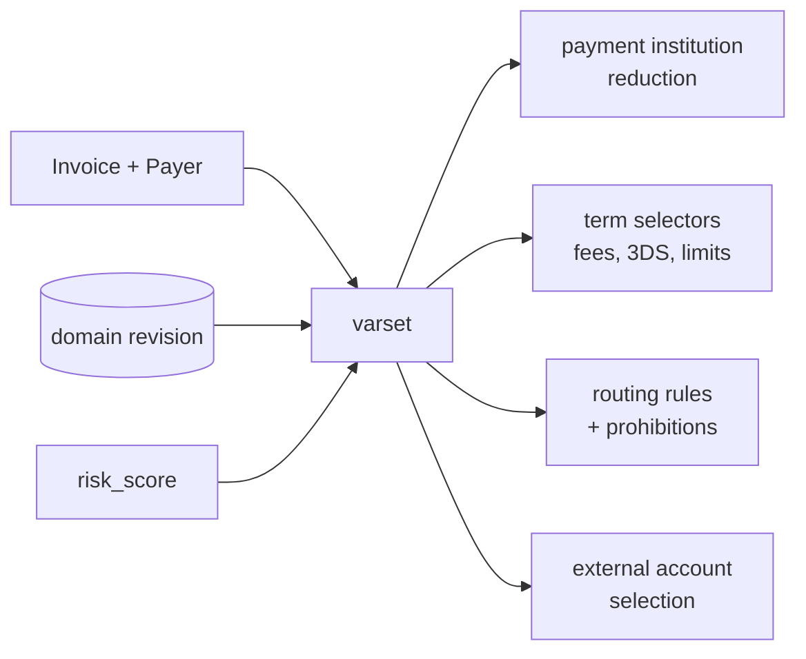

# Domain, party and varset

Hellgate is stateless with respect to configuration: every decision that
depends on merchant settings, provider terms, fees, limits, routing rules,
available payment methods or acceptable currencies is resolved against the
**domain**, a versioned configuration store owned by DMT. This page
documents how that lookup works and which hooks feed it.

## Domain (DMT)

Module: [hg_domain.erl](../apps/hellgate/src/hg_domain.erl).

All domain access flows through `hg_domain:get/2`:

```erlang
get(Revision, Ref) ->
    try extract_data(dmt_client:checkout_object(Revision, Ref))
    catch throw:#domain_conf_v2_ObjectNotFound{} ->
        error({object_not_found, {Revision, Ref}})
    end.
```

- `Revision` is either the symbolic `latest` or a concrete integer version.
  Hellgate *pins* a revision at the beginning of a payment flow and passes
  it through the whole call chain — routing, term evaluation and
  accounting all use the same revision so a config change mid-payment
  cannot corrupt the outcome.
- `Ref` is one of the domain reference tuples: `{party_config, …}`,
  `{shop_config, …}`, `{provider, ProviderRef}`, `{terminal, TerminalRef}`,
  `{proxy, ProxyRef}`, `{limit_config, …}`, `{category, …}`,
  `{currency, …}`, `{payment_institution, …}`, `{inspector, …}`, and so on.
- `dmt_client` is the shared DMT RPC client; Hellgate does not cache
  outside of its short-lived per-request context.

Every event that records a decision tied to the domain (route selection,
cash flow, limits) also records the revision used, so the entire decision
can be reconstructed deterministically.

## Party and shop

Module: [hg_party.erl](../apps/hellgate/src/hg_party.erl).

A **party** owns one or more **shops**. Both are addressed by
`party_config_ref()` and `shop_config_ref()` respectively and stored as
domain objects:

```erlang
get_party(PartyConfigRef) ->
    checkout(PartyConfigRef, get_party_revision()).

get_shop(ShopConfigRef, PartyConfigRef, Revision) ->
    try dmt_client:checkout_object(Revision, {shop_config, ShopConfigRef}) of
        #domain_conf_v2_VersionedObject{
            object = {shop_config, #domain_ShopConfigObject{
                data = #domain_ShopConfig{party_ref = PartyConfigRef} = ShopConfig
            }}
        } ->
            {ShopConfigRef, ShopConfig};
        _ -> undefined
    catch throw:#domain_conf_v2_ObjectNotFound{} -> undefined
    end.
```

Notice that `get_shop/3` validates that the shop belongs to the given
party — this is the main cross-check that keeps one party from touching
another's shop by guessing its ID.

Party objects carry:

- Owner metadata and contact details
- A list of shops
- Contract terms and KYC status
- Suspension and activation state
- Blocking status (fraud, AML, etc.)

Shops carry their own set of turnover limits, category, currency,
accepted payment tools and account references. Most of the per-merchant
behaviour a payment will see is ultimately sourced from the shop config.

### Operability checks

Before doing anything that mutates money, Hellgate asserts via
[`hg_invoice_utils`](../apps/hellgate/src/hg_invoice_utils.erl) that the
party and shop are *operable* — not blocked, not suspended, contract
active. A failing check aborts the operation with a clear error instead
of creating a dangling machine.

## Varset

Module: [hg_varset.erl](../apps/hellgate/src/hg_varset.erl).

The varset is a small map of the variables the domain uses to reduce
selectors. Think of it as the "question" we're asking the domain. It is
assembled as the payment progresses, with later stages adding more keys:

```erlang
-type varset() :: #{
    category         => dmsl_domain_thrift:'CategoryRef'(),
    currency         => dmsl_domain_thrift:'CurrencyRef'(),
    cost             => dmsl_domain_thrift:'Cash'(),
    payment_tool     => dmsl_domain_thrift:'PaymentTool'(),
    party_config_ref => dmsl_domain_thrift:'PartyConfigRef'(),
    shop_id          => dmsl_base_thrift:'ID'(),
    risk_score       => hg_inspector:risk_score(),
    flow             => instant | {hold, dmsl_domain_thrift:'HoldLifetime'()},
    wallet_id        => dmsl_base_thrift:'ID'()
}.
```

When it is handed to DMT, `prepare_varset/1` converts it into the Thrift
`#payproc_Varset{}` struct DMT selectors evaluate against.

### Where the varset drives behaviour

- **Routing** (`hg_routing:gather_routes/5`): filters routing rules and
  prohibitions, producing the candidate list.
- **Term resolution**: fees, 3DS requirements, allowed payment methods,
  hold lifetimes and other per-operation rules are selected from the
  party/shop/provider terms against the varset.
- **Payment institution resolution**
  (`hg_payment_institution:compute_payment_institution/3`): picks system
  and external accounts by currency and varset.
- **Inspector**: the inspector is selected from the domain using the same
  varset, so a shop can use different risk engines for different
  categories or payment tools.

The varset is the single bottleneck through which every "what does
config say here?" question in Hellgate has to pass. This is the reason a
design change that adds, say, a new routing dimension starts with a new
varset key.



> [!IMPORTANT]
> The varset is cumulative: later stages add keys. Earlier stages must
> not depend on keys that are only filled in later (e.g. routing has a
> `risk_score` because the inspector runs first; it does **not** have a
> `provider_ref` because routing is what sets it).

## Payment institution

Module: [hg_payment_institution.erl](../apps/hellgate/src/hg_payment_institution.erl).

A payment institution is the top-level config blob for "a way of
accepting payments" — typically one per legal entity / licence / scheme.
It owns:

- Routing rules (policies + prohibitions)
- Default cash flow postings
- System account references per currency
- External account sets (selected by varset)
- Inspector and proxy references

`compute_payment_institution/3` reduces the referenced payment
institution against the varset and returns the concrete struct used by
routing, term resolution and accounting. Any per-request domain
variability lives inside that reduction; downstream code just sees the
resolved values.

## Payment tools

Module: [hg_payment_tool.erl](../apps/hellgate/src/hg_payment_tool.erl).

Thin helper to extract the `PaymentTool` from a `Payer` variant (direct
card, recurrent token, payment terminal, digital wallet, crypto, etc.).
The payment tool is what enters the varset under `payment_tool` and what
the provider adapter ultimately consumes.

## Request context

Module: [hg_context.erl](../apps/hellgate/src/hg_context.erl).

Per-request auxiliary data (Woody deadline, trace id, party client,
domain revision, current log scope) is stashed in a small record kept in
the process dictionary via `save/1`, `load/0`, `cleanup/0`. Long-running
call chains (especially repair and the Progressor processor callback)
save-and-cleanup around the handler to keep request scopes from leaking.

## Putting it together

A concrete example of how party + DMT + varset come together on
`CreatePayment`:

1. The handler resolves the party and shop from the invoice
   (`hg_party`) and asserts they are operable.
2. It builds an initial varset from the invoice and the payer.
3. It pins the current domain revision.
4. It calls the inspector (`hg_inspector`) to get a risk score; the
   score goes into the varset.
5. It resolves the payment institution
   (`hg_payment_institution:compute_payment_institution/3`) and reduces
   routing rules against the varset.
6. Routing (`hg_routing`) produces a candidate list; cash flow
   (`hg_cashflow`) is reduced against the same varset once a candidate
   is chosen.
7. Terms (fees, limits) are reduced against the same varset before
   limits are held and the provider call is issued.

The same revision + varset pair is threaded through every subsequent
state transition, so replaying a payment's history is deterministic even
if the domain has moved on.
