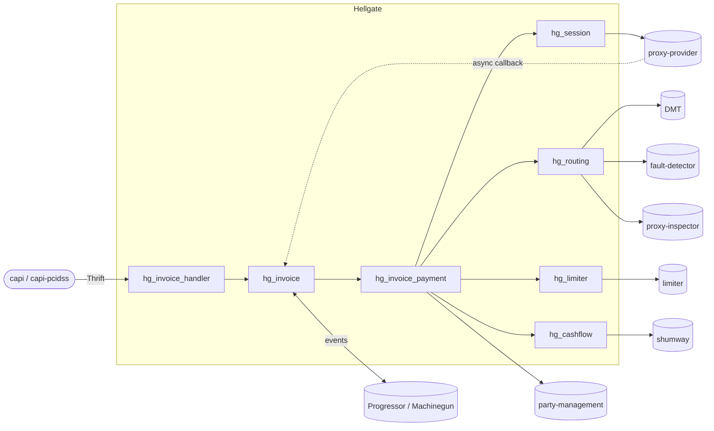

# Hellgate documentation

Hellgate is the core payment processing service of the platform. It implements
the authoritative state machine for invoices, payments, refunds and
chargebacks, selects a payment route through the configured providers and
terminals, enforces merchant/provider turnover limits, drives provider adapters
over Woody/Thrift, and writes the resulting postings into the double-entry
accounter (shumway).

Almost everything Hellgate does is expressed as deterministic event-sourced
transitions over the [`hg_machine`](../apps/hellgate/src/hg_machine.erl)
abstraction, backed by either [Progressor](../apps/hg_progressor) (the
production backend, pinned in [`config/sys.config`](../config/sys.config)) or
Machinegun (the code-level default and legacy backend).

> [!NOTE]
> Docs last verified against `fb3cabd4`. Claims that reference specific
> Erlang type names or module lines may drift after refactors — when in
> doubt, follow the linked source.

## Business-domain documentation

1. [Architecture overview](architecture.md) — what Hellgate is, which OTP
   applications live here, which external services it depends on, and how a
   single API call flows through the system.
2. [State machines](state-machines.md) — the `hg_machine` behaviour, invoice /
   payment / refund / chargeback / session lifecycles, retries, cascades,
   recurrent paytools.
3. [Routing](routing.md) — how route candidates (provider + terminal pairs) are
   gathered from the domain, filtered by prohibitions, fault detector and
   blacklist, scored and chosen.
4. [Route pins](route_pins.md) — how a payer is pinned to a specific candidate
   within an equal-priority group.
5. [Limits and accounting](limits-and-accounting.md) — turnover limits
   (hold/commit/rollback), cash flow computation, allocation, and shumway
   posting plans.
6. [Providers, sessions and callbacks](provider-proxy.md) — sessions, the
   provider proxy protocol, async callbacks via tags, timeout behaviour, token
   generation for recurrent paytools.
7. [Risk, repair and operations](risk-and-repair.md) — inspector integration,
   risk scores, blacklists, the repair API for stuck machines.
8. [Domain, party and varset](domain-and-party.md) — how configuration from
   party-management and DMT is resolved at each step through the varset.

## Erlang/OTP and build docs

The top-level [README](../README.md) and [`CLAUDE.md`](../CLAUDE.md) document
the build and test commands, Erlang coding conventions, and the Docker /
Docker-Compose workflow for running the full dependency stack.
