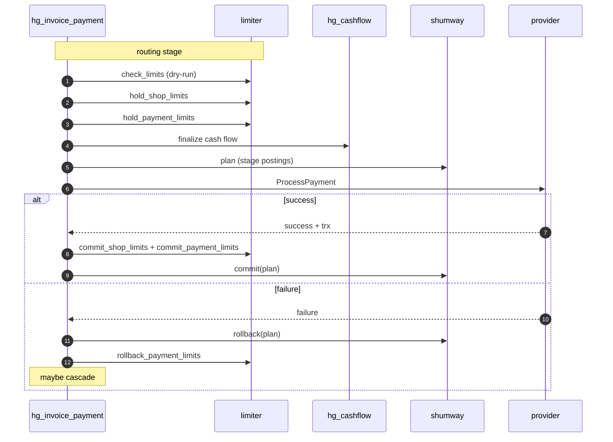

# Limits and accounting

Hellgate handles two orthogonal financial concerns on every payment:

- **Turnover limits** — policy controls that restrict how much money can flow
  through a given dimension (shop, provider, terminal, card, etc.) over a
  rolling window.
- **Accounting** — double-entry postings against the accounter service
  (shumway) that reflect what actually moved.

Both subsystems are designed around a three-phase pattern (`hold` / `commit`
/ `rollback`) so that Hellgate can reserve capacity and posting intent *before*
the provider call and finalise it *after* we know the outcome.

## Turnover limits

Module: [hg_limiter.erl](../apps/hellgate/src/hg_limiter.erl) (plus the
Woody client wrapper in
[hg_limiter_client.erl](../apps/hellgate/src/hg_limiter_client.erl)).

### Where limits come from

Turnover limits are declared in the domain and attached to two kinds of
objects:

- **Shops** — `#domain_ShopConfig{turnover_limits = [...]}`
- **Providers / Provision terms** —
  `#domain_PaymentsProvisionTerms{turnover_limits = {value, [...]}}`

Each reference points at a `#domain_LimitConfig{}` that the limiter service
owns. Hellgate is only responsible for knowing *which* limits apply to a
given operation at a given revision — the limiter enforces the numeric
ceiling.

### The operation identity

Holds are idempotent on an operation ID. Hellgate derives the operation ID
from stable properties of the payment:

- Payment-level limits: `[provider_id, terminal_id, invoice_id, payment_id, iteration]`
- Shop-level limits: `[party_id, shop_id, invoice_id, payment_id]`
- Refund/chargeback flows: analogous lists that include the refund or
  chargeback ID.

The `iteration` component is the cascade attempt counter, which lets the
limiter distinguish "same payment, retried on a different route" from "new
payment" without double-counting.

### Payment limits — hold / commit / rollback

```erlang
check_limits([turnover_limit()], Invoice, Payment, Session | undefined, Route, Iter)
    -> {ok, [turnover_limit_value()]}
     | {error, {limit_overflow, [binary()], [turnover_limit_value()]}}.

hold_payment_limits(Limits,     Invoice, Payment, Session, Route, Iter).
commit_payment_limits(Limits,   Invoice, Payment, Session, Route, Iter, BinaryOperationId | undefined).
rollback_payment_limits(Limits, Invoice, Payment, Session, Route, Iter, BinaryOperationId | undefined).
```

- `check_limits/6` is a *dry-run* — it returns the current limit values so the
  payment can fail fast (the routing step calls this to reject overflowing
  candidates).
- `hold_payment_limits/6` is the real reservation. It is called once the
  route is chosen and the cash flow has been built, right before the provider
  call.
- `commit_payment_limits/7` finalises the hold on capture success.
- `rollback_payment_limits/7` releases the hold on cascade / retry / final
  failure so that the reserved capacity becomes available again.

### Shop and refund limits

Shop limits (`check_shop_limits/5`, `hold_shop_limits/5`, etc.) and refund
limits (`hold_refund_limits/5`, `commit_refund_limits/5`,
`rollback_refund_limits/5`) follow exactly the same three-phase contract.

Refunds reverse capture holds: a refund hold effectively releases the
corresponding capture hold on the same limit bucket, so a fully refunded
payment becomes invisible to turnover limits (as intended).

## Cash flow

Module: [hg_cashflow.erl](../apps/hellgate/src/hg_cashflow.erl), plus
helpers in [hg_cashflow_utils.erl](../apps/hellgate/src/hg_cashflow_utils.erl).

### The model

A *cash flow* is a list of postings:

```erlang
-type posting() :: #domain_CashFlowPosting{
    source      = account(),      % merchant | provider | system | external
    destination = account(),
    volume      = cash_volume(),  % fixed | share | product
    details     = binary()        % human-readable description
}.
```

Volumes are computed, not static:

```erlang
?fixed(Cash)                             % literal amount
?share(P, Q, Of, Rounding)               % P/Q of another amount
?product([Op, V1, V2, ...])              % composition
```

`Of` is a reference to another amount in the same flow (usually the payment
amount) so that commission-style postings stay correct when the base changes.

### Finalisation

`hg_cashflow:finalize/3` takes the abstract template, a context containing
the monetary parameters, and an `AccountMap` that resolves each abstract
account to a concrete account ID:

```erlang
compute_postings(CF, Context, AccountMap) ->
    [
        ?final_posting(
            construct_final_account(Source, AccountMap),
            construct_final_account(Destination, AccountMap),
            compute_volume(Volume, Context),
            Details
        )
     || ?posting(Source, Destination, Volume, Details) <- CF
    ].
```

The account map is built by
[`hg_accounting:collect_account_map/1`](../apps/hellgate/src/hg_accounting.erl)
and has four concrete halves:

- **Merchant accounts** — settlement and guarantee from the shop config.
- **Provider accounts** — the chosen provider's settlement account for the
  payment currency.
- **System accounts** — settlement and subagent accounts from the payment
  institution for the payment currency.
- **External accounts** — income/outcome accounts selected from the payment
  institution's external account sets via the varset.

### Reversal

Refunds and chargeback steps reverse a flow by swapping source and
destination on every posting:

```erlang
revert(CF) ->
    [?final_posting(Destination, Source, Volume, revert_details(Details))
     || ?final_posting(Source, Destination, Volume, Details) <- CF].
```

## Accounting (shumway)

Module: [hg_accounting.erl](../apps/hellgate/src/hg_accounting.erl).

The accounter is a straightforward double-entry ledger. Hellgate drives it
with *posting plans*:

- `plan(CashFlow, Context)` — submit staged postings. The accounter computes
  the effect on each account's balance but does not make it visible yet.
- `commit(PlanLog, PlanIDs)` — materialise the staged batches.
- `rollback(PlanLog, PlanIDs)` — discard them.

Each payment can produce several plan IDs over its life (authorisation,
capture, refund, chargeback stages), and the payment state machine carries
the plan log forward so that commits and rollbacks target the right batches.

Accounting follows the state machine, not the other way around: posts are
staged when the corresponding activity starts (e.g.
`processing_accounter`) and committed when the activity resolves
successfully (`finalizing_accounter`). This keeps the ledger consistent
with what the state machine believes and lets us recover from a crash
between stage and commit by replaying events.

## Allocation

Module: [hg_allocation.erl](../apps/hellgate/src/hg_allocation.erl).

Allocation splits a payment across multiple recipients (think marketplace
sub-merchants). The domain types (`AllocationPrototype`, `Allocation`,
`AllocationTransaction`) and the arithmetic (`sub/2`, etc.) are in place,
but the feature is currently turned off:

```erlang
calculate(_Prototype, _Party, _Shop, _Cost, _Terms) ->
    {error, allocation_not_allowed}.
```

When enabled, allocation interleaves with cash flow: each allocation
transaction produces an additional sub-flow that is accounted for in
shumway and can be refunded independently.

## Putting it together

On a happy-path payment the finance subsystems execute in this order:



Refunds and chargebacks run the same pattern on their own plans and
inverted cash flows, so every terminal state leaves the ledger and the
limiter in a consistent place.

> [!WARNING]
> The operation ID passed to the limiter must remain stable across retries
> of the *same* attempt and must change across cascades. `iter` exists
> specifically so that a cascade to a new route is a new operation, not a
> double-count of the old one.
