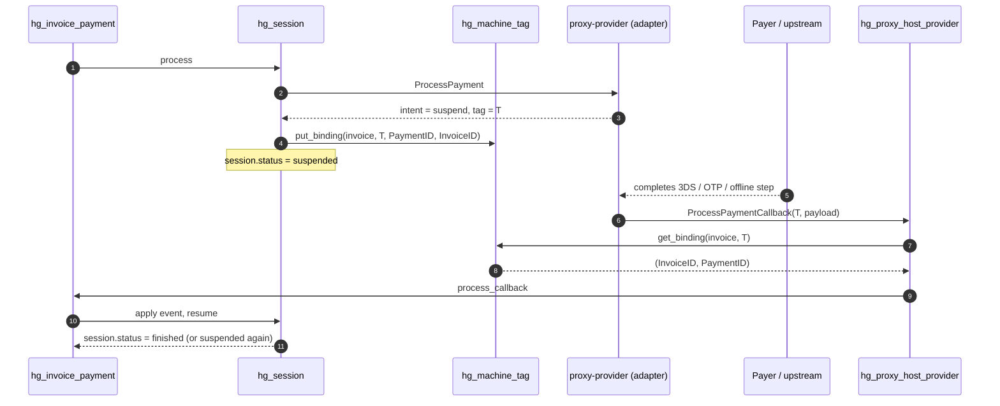

# Providers, sessions and callbacks

Hellgate never talks directly to an acquirer, a 3-D Secure directory server
or an alternative-payment-method back end. Every external provider sits
behind a *provider proxy* — a separate Woody service that implements the
`proxy-provider` Thrift protocol and translates between the generic
Hellgate model and the provider's own API.

This page describes how Hellgate invokes those adapters, how it receives
their callbacks, and how sessions keep everything consistent.

## The adapter protocol

Three RPCs on the `proxy-provider` interface are invoked from Hellgate:

```erlang
process_payment(ProxyContext, Route).
handle_payment_callback(Payload, ProxyContext, Route).
generate_token(ProxyContext, Route).
```

Implementation lives in
[`hg_proxy_provider.erl`](../apps/hellgate/src/hg_proxy_provider.erl).

Each call carries a `ProxyContext` — a self-contained snapshot of payment
info, previous session state (opaque to Hellgate), and merged
`ProxyOptions`. The options are collected by
`hg_proxy_provider:collect_proxy_options/1` which merges three layers,
terminal-specific first, provider-additional next, and proxy-definition
defaults last:

```erlang
lists:foldl(fun(undefined, M) -> M; (M1, M) -> maps:merge(M1, M) end, #{}, [
    Terminal#domain_Terminal.options,
    Proxy#domain_Proxy.additional,
    ProxyDef#domain_ProxyDefinition.options
]).
```

This layering lets the same provider be reused across terminals while
still allowing per-terminal overrides.

The adapter reply is a `provider intent`:

- `{finish, FinishIntent}` — the adapter is done. Outcomes include
  success (with a transaction reference to record), failure (propagated
  back into the payment's failure channel), or a user-visible reason.
- `{sleep, SleepIntent}` — poll again after a timer. Hellgate sets a
  machine timer; when it fires, the session resumes.
- `{suspend, SuspendIntent}` — register a tag and wait for an async
  callback.

See the `hg_session` module for how intents are decoded into activity
transitions.

## Sessions

Module: [hg_session.erl](../apps/hellgate/src/hg_session.erl).

A session is one conversation with one adapter about one target state. The
struct is kept small on purpose because it is persisted as part of the
payment's event history:

- `target` — the final status we want to drive this conversation towards
  (`processed`, `captured`, `cancelled`, `refunded`).
- `status` — `active | suspended | finished`.
- `tags` — the currently registered callback tags for this session.
- `route` — the `(provider, terminal)` we're talking to.
- `proxy_state` — an opaque binary the adapter asks us to pass back on
  every RPC. Hellgate never inspects it.
- `interaction` — a structured description of any UI the user sees (3DS
  redirect, OTP page, QR code, …); also feeds into cascade logic.
- `ui_occurred` — a latching boolean set the first time the user
  interacts. Cascade will not retry after this flips.
- `timings` — timestamps captured for diagnostics and SLAs.
- `repair_scenario` — optional manual override injected via the repair API.

Lifecycle:

1. `create/0` + `set_payment_info/2` — blank session, payment info attached.
2. `process/1` — first RPC to the adapter. Hellgate interprets the intent
   and decides whether to finish, sleep or suspend.
3. `apply_event/3` — on each subsequent event (timer fire, callback arrival,
   manual repair), advance the session state.
4. `deduce_activity/1` — derive the next payment activity (`flow_waiting`,
   `processing_capture`, `finalizing_session`, …) from the session's
   current status.

## Tags and async callbacks

Async delivery is necessary because many provider flows are inherently
out-of-band (3DS redirects, bank push notifications, offline bank transfer
confirmation). Hellgate uses a *tag* as the rendezvous point between a
suspended session and an incoming callback.



Module: [hg_machine_tag.erl](../apps/hellgate/src/hg_machine_tag.erl).

At session creation (or when the adapter returns a `suspend` intent) a tag
is registered:

```erlang
put_binding(<<"invoice">>, Tag, PaymentID, InvoiceID).
```

The tag is handed to the adapter, which embeds it in whatever
user-facing URL the payer hits or passes it to the upstream system that
will later confirm the operation. When the adapter calls back into
Hellgate it invokes `ProcessPaymentCallback` on the
[`ProviderProxyHost`](../apps/hg_proto/src/hg_proto.erl) Thrift service
(mounted at `/v1/proxyhost/provider` by `hg_proto:get_service_spec/2`),
passing the tag **inside the Thrift payload** — the URL path itself is
fixed. The handler
[`hg_proxy_host_provider`](../apps/hellgate/src/hg_proxy_host_provider.erl)
then:

1. Resolves `tag → (InvoiceID, PaymentID)` via
   [`hg_machine_tag:get_binding/2`](../apps/hellgate/src/hg_machine_tag.erl).
2. Calls `hg_invoice:process_callback/2` on the invoice machine.
3. The invoice routes the callback into the correct payment/session.
4. The session either finishes (success/failure), sleeps again, or stays
   suspended under a new tag.

This layer is the reason the callback endpoint is *host-side* — the
adapter is a client of Hellgate for the callback, not the other way
round.

## Timeout behaviour

Each session declares a `timeout_behaviour()` from the domain. In broad
strokes:

- Immediate — the adapter promised to respond synchronously; no polling
  needed.
- Polling — the adapter is slow but pollable; Hellgate sets a timer and
  calls `process/1` again when it fires.
- Callback — the adapter will drive completion via an async callback; the
  timer is used as a fail-safe if the callback never arrives.

Timers are implemented by the `set_timer` action returned from the
machine's `process_signal/2` and are honoured by the automaton backend.

## Fault detector integration

Every adapter RPC is reported to the fault detector. The client module
[`hg_fault_detector_client`](../apps/hellgate/src/hg_fault_detector_client.erl)
registers operations on start and finish and queries rolling statistics
at routing time. The statistics feed two decisions:

- The route's availability (`alive`/`dead`) — a `dead` route is rejected
  from the candidate list.
- The route's expected conversion rate — used as part of the scoring tuple
  when two candidates tie on priority.

Because statistics are reported per operation, a provider that is healthy
for authorisations but broken for refunds will be marked dead only for the
broken flow.

> [!CAUTION]
> The `proxy_state` binary returned by an adapter is opaque to Hellgate and
> is persisted verbatim into the session event. Adapters must treat it as
> their own forward-compatible serialisation format — a non-backwards-
> compatible change will break in-flight sessions on replay.

## Generating recurrent tokens

For recurrent paytools the flow is similar, but the RPC is
`generate_token/2`. The response becomes the paytool's permanent payment
resource — subsequent payments against the same paytool skip the
cardholder-interactive stages entirely and drive the adapter through its
"use a previously-tokenised card" path.

## Provider-side diagnostics

Two modules exist purely to make provider conversations observable:

- [`hg_proxy.erl`](../apps/hellgate/src/hg_proxy.erl) — low-level call
  options helper shared across proxy types (provider and inspector).
- [`hg_profiler.erl`](../apps/hellgate/src/hg_profiler.erl) and the
  `hg_timings` helper record per-session timings that are later attached
  to events and surfaced in payment state.

Together with the fault detector and the `interaction` field on sessions
this gives a fairly granular operational picture of every provider call.
