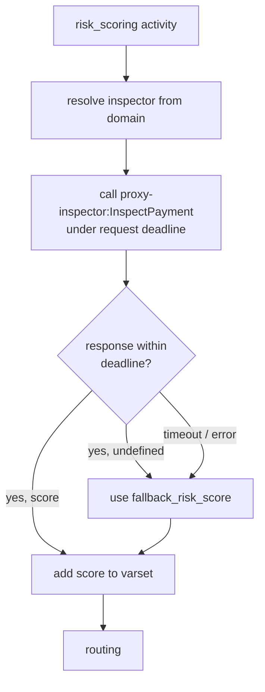

# Risk, repair and operations

Two adjacent subsystems sit around the payment state machine to keep the
system safe and recoverable:

- [Risk inspection](#risk-inspection) — assigns every payment a coarse
  risk level and screens against card-level blacklists before routing.
- [Repair](#repair) — a controlled backdoor that lets operators nudge a
  stuck payment into a known-good state.

## Risk inspection

Module: [hg_inspector.erl](../apps/hellgate/src/hg_inspector.erl).

Risk inspection is a Woody call to the `proxy-inspector` service. Hellgate
picks the inspector definition from the domain (`#domain_Inspector{}`),
merges proxy options the same way it does for providers, and calls
`InspectPayment`:

```erlang
inspect(Shop, Invoice, Payment, Inspector) ->
    Context = #proxy_inspector_Context{
        payment = get_payment_info(Shop, Invoice, Payment),
        options = maps:merge(ProxyDef#domain_ProxyDefinition.options,
                             Proxy#domain_Proxy.additional)
    },
    {ok, RiskScore} = issue_call('InspectPayment', {Context},
                                 hg_proxy:get_call_options(Proxy, Revision),
                                 FallBackRiskScore, Deadline),
    RiskScore.
```

Notable properties:

- **Risk scores are coarse.** The inspector returns `low | medium | high`
  — a bucket, not a number. Downstream code uses the bucket as part of the
  varset for routing and for term resolution.
- **Fallback is explicit.** If the inspector times out, returns `undefined`
  or errors out, Hellgate returns the configured `fallback_risk_score`.
  Payments never get stuck waiting for the inspector.
- **Deadlines are honoured.** The call runs under the Woody deadline from
  the current request, so slow inspectors degrade to their fallback rather
  than holding the machine hostage.



### Blacklist checks

The inspector also serves the per-route blacklist that the routing layer
consults. `hg_inspector:check_blacklist/1` builds a context of

```erlang
#proxy_inspector_BlackListContext{
    first_id   = ProviderID,
    second_id  = TerminalID,
    field_name = <<"CARD_TOKEN">>,
    value      = Token
}
```

and calls `IsBlacklisted`. A `true` return knocks the route out of the
candidate list with reason `in_blacklist` (see
[Routing → Stage 3](routing.md#stage-3--blacklist-filtering)). Payments
without a token (e.g. alternative payment methods) skip the check.

### How the score is used

The risk score flows into the payment pipeline at two points:

- It is added to the **varset** (`hg_varset.erl`). Routing rules, term
  selectors and fee selectors can therefore branch on risk — for
  example, routing only low-risk payments to a cheap provider, or
  charging a premium on high-risk ones.
- It gates 3-D Secure / step-up selection through the domain-level
  payment method conditions.

The inspector is *not* an allow/deny gate in itself — Hellgate relies on
domain configuration (routing + terms) to turn the score into a policy.

## Repair

Module: [hg_invoice_repair.erl](../apps/hellgate/src/hg_invoice_repair.erl).

Every state machine exposes a `repair/3` entry point (via the `hg_machine`
behaviour). For invoices the repair surface is designed specifically to
unstick payments that have ended up in an inconsistent state — usually
because a provider vanished, a session timed out in an unusual way, or
a manual intervention is required to reconcile with an acquirer.

### Repair scenarios

Operators submit a `#payproc_InvoiceRepairScenario{}` which is one of:

| Scenario                       | Effect |
| ------------------------------ | ------ |
| `fail_pre_processing`          | Force the payment into `failed` with a supplied `#domain_Failure{}` *before* any side-effect (no route chosen, no limit held, no provider called). |
| `skip_inspector`               | Substitute a supplied `risk_score` for the inspector call. Useful when the inspector itself is misbehaving. |
| `fail_session`                 | Inject a session *failure* into the in-flight session: the payment sees the session as if the provider had returned the given failure and trx info. |
| `fulfill_session`              | Inject a session *success* into the in-flight session: the payment sees the session as if the provider had returned success and the given trx info. |
| `complex`                      | A list of scenarios to try in order; the first one whose activity matches fires. |

### Safety checks

`hg_invoice_repair:check_activity_compatibility/2` enforces that a scenario
only runs when the payment is in a compatible activity. For example,
`fail_pre_processing` is rejected once the payment is past routing;
`repair_session` is rejected if there is no session to repair. This keeps
repair from silently skipping state (and money) it should not touch.

The repair path also requires an explicit revision input — operators must
state the domain revision they are repairing against — which prevents a
drifted config from bleeding into a repair that was prepared against an
older view of the world.

> [!CAUTION]
> Repair is a privileged operation. `fulfill_session` in particular writes
> a *success* event for a payment the provider never acknowledged — it
> must only be used when a real reconciliation with the acquirer has
> confirmed the outcome. Getting this wrong means booking money that
> didn't move.

### Typical uses

- A provider adapter is permanently offline: use `fail_session` with an
  appropriate failure so the payment fails properly and limits roll back.
- An acquirer confirmed out-of-band that a transaction succeeded but the
  provider's callback never arrived: use `fulfill_session` with the real
  trx info.
- A misconfigured inspector keeps returning `undefined` for a specific
  payment shape: use `skip_inspector` with an appropriate fallback.
- A known-bad invoice has to be terminated before it has any side effects:
  use `fail_pre_processing`.

Every repair operation goes through the same event-sourcing pipeline as a
normal call, so the repair itself is fully auditable — the emitted events
indicate that the new state came from a repair scenario rather than a
provider or customer action.

## Operations summary

Taken together, risk inspection and repair make the state machine robust
against two common failure modes in payment processing:

- *Up-front uncertainty* — the inspector gives a cheap, bounded screen
  before committing the payment to an expensive route, and degrades
  gracefully if the inspector is unreachable.
- *Tail-end stuckness* — if a payment has wandered off the happy path but
  the correct resolution is known, repair lets an operator apply it
  without bypassing event sourcing, accounting or limits.

Everything else — routing failures, provider timeouts, transient retry
loops — is meant to resolve itself via cascade and retry without human
intervention.
