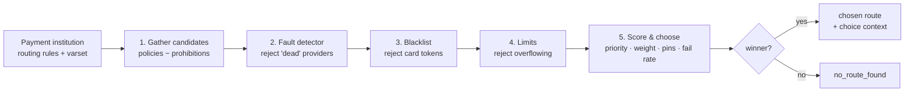

# Routing

Routing is the process of turning an abstract payment into a concrete
`(Provider, Terminal)` pair that will actually talk to a real acquirer. The
code lives in the `routing` OTP application under
[`apps/routing/src/`](../apps/routing/src) — `hellgate` calls into it but
keeps no routing state of its own.

The main entry point is
[`hg_routing:gather_routes/5`](../apps/routing/src/hg_routing.erl); the
routing *context* (`hg_routing_ctx`) is the value threaded through every
stage, accumulating candidates, rejections and score information.



## The shape of a route

A route is the `routing` app's view of a `(Provider, Terminal)` candidate
plus everything needed to filter and score it:

- `provider_ref` / `terminal_ref`
- `priority` — integer, lower is preferred
- `weight` — used for tie-breaking within a priority band
- `pins` — payer-identifying characteristics (see [route_pins.md](route_pins.md))
- `domain_revision` — the DMT revision the candidate was resolved at

## Stage 1 — gathering candidates

```erlang
gather_routes(Predestination, PaymentInstitution, Varset, Revision, GatherContext) ->
    case PaymentInstitution#domain_PaymentInstitution.payment_routing_rules of
        undefined -> hg_routing_ctx:new([]);
        #domain_RoutingRules{policies = Policies, prohibitions = Prohibitions} ->
            Candidates = get_candidates(Policies, Varset, Revision),
            {Accepted, RejectedRoutes} = filter_routes(
                collect_routes(Candidates, Predestination, Revision),
                get_table_prohibitions(Prohibitions, Varset, Revision)
            ),
            hg_routing_ctx:new(Accepted)
    end.
```

The steps are:

1. Look up the payment institution for the invoice's shop.
2. Walk its `payment_routing_rules` — policies and prohibitions. Both are
   DMT selector trees evaluated against the **varset** (category, currency,
   cost, payment tool, risk score, party config ref, shop id, flow, wallet
   id, etc.; see [Domain, party and varset](domain-and-party.md)).
3. Expand the matching policies into concrete `(Provider, Terminal)`
   candidates.
4. Filter out any candidate that matches a prohibition.

At this point `hg_routing_ctx` holds the *accepted* candidates and the
reason each rejected candidate dropped out.

## Stage 2 — fault-detector filtering

Even if the domain allows a candidate, the fault detector may have flagged
its provider as effectively dead. `hg_routing:filter_by_critical_provider_status/1`
pulls statistics from [`hg_fault_detector_client`](../apps/hellgate/src/hg_fault_detector_client.erl),
scores every candidate (availability + conversion rate) and rejects anything
whose availability status is `dead`:

```erlang
{R1, {{dead, _} = AvailabilityStatus, _ConversionStatus}} ->
    hg_route:to_rejected_route(R, {'ProviderDead', AvailabilityStatus})
```

Scores (and the `dead`/`alive` split) are cached into the context so that
later stages can re-use them for final ranking without a second RPC.

## Stage 3 — blacklist filtering

[`hg_routing:filter_by_blacklist/2`](../apps/routing/src/hg_routing.erl) runs
every remaining candidate against the inspector's blacklist:

```erlang
check_routes([Route|Rest], BlCtx) ->
    % For each (provider, terminal, card_token) call proxy-inspector:IsBlacklisted
```

Blacklists are keyed on `(provider_id, terminal_id, CARD_TOKEN, <token>)`.
Anything blacklisted is rejected with reason `in_blacklist`.

Token-less candidates (e.g. when we do not yet have a payment tool, or the
payment is cash-on-delivery style) skip this check.

## Stage 4 — limits

Turnover limits can also eliminate candidates. Before selecting a route,
Hellgate evaluates the per-provider / per-terminal turnover limits and marks
overflowing candidates as rejected with reason `limit_overflow`. See
[Limits and accounting](limits-and-accounting.md) for the limiter model.

## Stage 5 — scoring and choice

Whatever survives is ranked. The individual route score is assembled from:

- Priority (primary key — lower wins)
- Weight (secondary; interacts with pins)
- Fault-detector availability + conversion rate
- Blacklist status

`hg_routing:choose_rated_route/1` sorts by the tuple
`(availability, priority, weight-driven pin score, fail rate)` and picks the
head. It returns both the chosen route and a *choice context* that records
which alternative would otherwise have won and why each loser lost — this is
the payload consumed by
[`hg_routing_explanation`](../apps/routing/src/hg_routing_explanation.erl) to
produce human-readable "why did we pick this route" output surfaced via the
payproc API.

## Route pins

Full details in [route_pins.md](route_pins.md). In short: within a group
of candidates with the same priority and weight, each candidate can
declare a list of payer *features* (e.g. `[email]` or `[email, client_ip]`)
via `#domain_RoutingPin{}`. At routing time the values of those features
are pulled from the routing context and attached to the candidate; when
two candidates in the same priority group share the same pin value, the
weight-based random tie-break is replaced by a deterministic
`phash2({pin, provider, terminal})` comparison.

The upshot is that the effective weight distribution collapses from, say,
`33:33:33` to `100:0:0` for a given payer if all three candidates share
the same pin set, keeping the payer "pinned" to the route they first
used. Candidates with different pin sets participate in their own,
independent pinning group, so the overall distribution still makes sense
across the population.

## Cascade: re-routing on failure

Cascade is the routing-level response to a failed session. See
[State machines → Cascade and retries](state-machines.md#cascade-and-retries)
for the trigger logic. Mechanically:

1. The payment records its current route and increments `iter`.
2. The routing context still holds the remaining candidates and their
   scores (they were stashed during stage 2).
3. The next candidate is picked with the same scoring rules, and a brand-new
   session is created against that route.

Because the fault detector's view can change between iterations,
`filter_by_critical_provider_status/1` is re-run at each cascade attempt —
a provider that was alive at attempt 1 may be dead by attempt 3.

## Rejections as first-class data

`hg_routing_ctx` keeps rejected candidates grouped by reason (not just a
flat drop list). The reasons it surfaces are:

- `adapter_unavailable` — marked dead by the fault detector
- `in_blacklist` — inspector rejected the token
- `forbidden` — matched a prohibition rule
- `limit_overflow` — would push a turnover limit over its ceiling

All four reasons are preserved in the final `ChoiceContext` so that operators
can see exactly why an expected route was not picked.

> [!NOTE]
> Stages 2 (fault detector) and 3 (blacklist) are each one RPC per
> candidate. If routing shows up as a latency hotspot, the candidate set is
> usually the thing to trim — either by tightening domain prohibitions or
> by narrowing the varset that selects policies.
