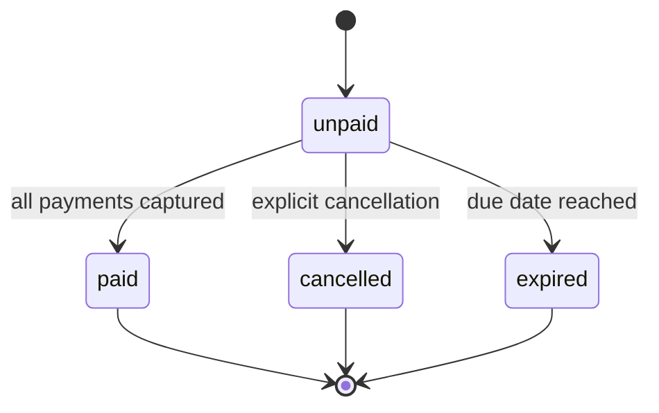
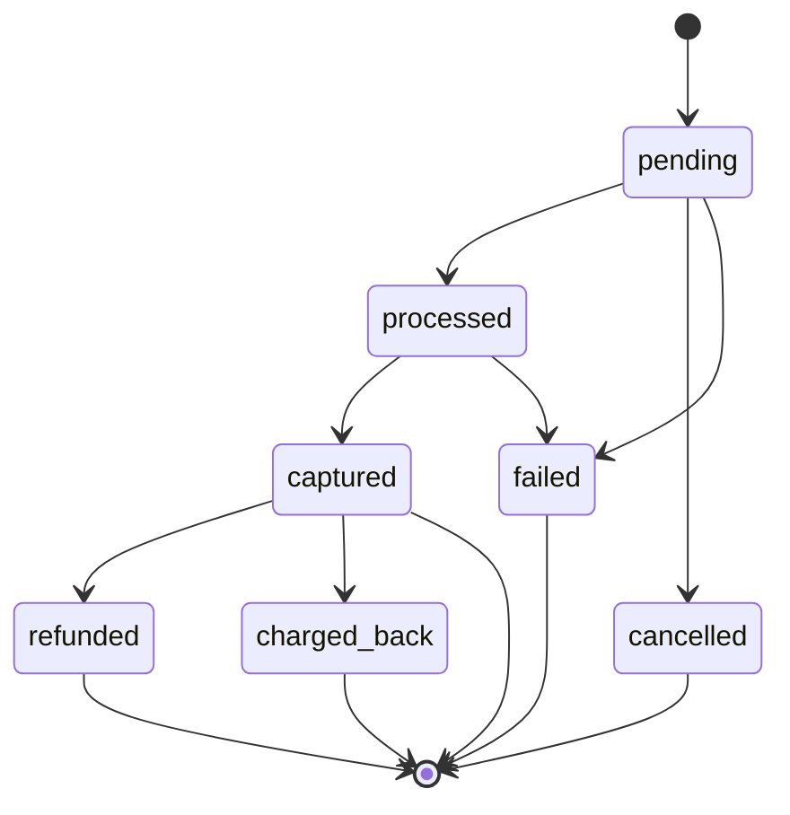
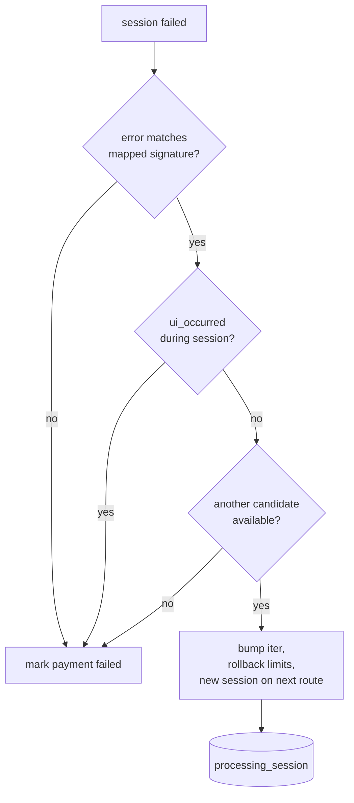
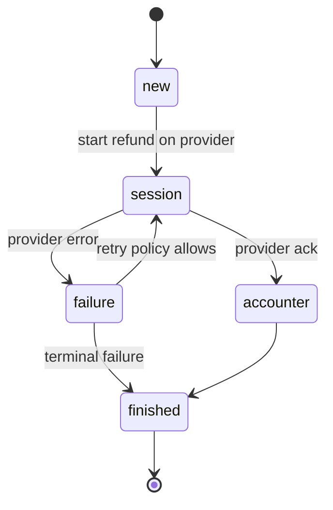
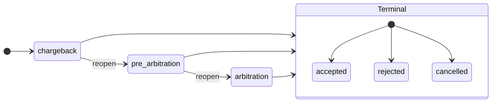
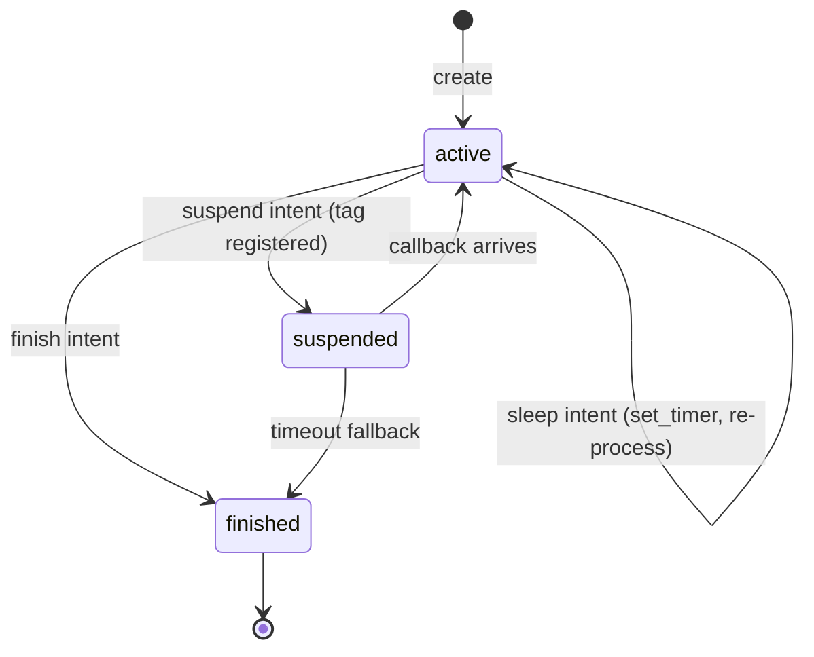

# State machines

Every durable entity in Hellgate — invoices, payments, refunds, chargebacks,
invoice templates, recurrent paytools — is an event-sourced state machine
implemented as a module that satisfies the
[`hg_machine`](../apps/hellgate/src/hg_machine.erl) behaviour.

## The `hg_machine` behaviour

From [hg_machine.erl](../apps/hellgate/src/hg_machine.erl):

```erlang
-type machine() :: #{
    id := id(),
    history := history(),
    aux_state := auxst()
}.

-type result() :: #{
    events => [event_payload()],
    action => hg_machine_action:t(),
    auxst => auxst()
}.

-callback namespace() -> ns().
-callback init(args(), machine()) -> result().
-callback process_signal(signal(), machine()) -> result().
-callback process_call(call(), machine()) -> {response(), result()}.
-callback process_repair(args(), machine()) -> result().
```

The backend hands Hellgate the full `history()` (list of past events) plus
`aux_state()` (an opaque cache used to skip replay of the whole history), and
Hellgate returns *new* events plus an optional `action`:

- `set_timer` — schedule a deadline (e.g. invoice expiration, session poll)
- `remove` — ask the backend to delete the machine
- `notify` — outgoing notifications

Calls come in three shapes:

- `hg_machine:start/3` — `init/2` builds the initial event list.
- `hg_machine:call/3` / `hg_machine:thrift_call/5` — synchronous, returns a
  response. Handled by `process_call/2`.
- `hg_machine:repair/3` — manual intervention, see [Repair](risk-and-repair.md#repair).

The top-level backend selector lives in `hg_machine:call_automaton/3` and
picks between Machinegun, Progressor and the hybrid router based on the
`hellgate` `backend` env var.

## Invoice machine

Module: [hg_invoice.erl](../apps/hellgate/src/hg_invoice.erl).
Namespace: `invoice`.

The invoice is the outer state machine. It owns:

- The immutable `#domain_Invoice{}` (shop, cost, due date, metadata, cart or
  product, optional mutations)
- Zero or more *nested* payment state machines keyed by `PaymentID`
- A cached reference to the party/shop at creation revision

Its internal state (`#st{}` in `hg_invoice.erl`) tracks which sub-entity is
currently "active":

```erlang
-type activity() ::
      invoice                 % waiting on payment creation or expiration
    | {payment, payment_id()}.
```

Key event types (from `payment_events.hrl`):

- `?invoice_created(Invoice)`
- `?invoice_status_changed(Status)`
- `?payment_ev(PaymentID, PaymentEvent)` — wraps nested payment events

Status transitions (from the domain):



The invoice handles the following calls (selected):

- `start_payment` — creates the nested payment machine
- `capture_payment` / `cancel_payment` / `refund_payment` — delegate to the
  relevant payment sub-machine
- `create_chargeback` / `accept_chargeback` / `reject_chargeback` / `reopen_chargeback`
- `process_callback` — async provider callback routed by tag

`timeout` signals are used for expiration and for session polling of nested
payments.

## Payment machine

Module: [hg_invoice_payment.erl](../apps/hellgate/src/hg_invoice_payment.erl)
(around 4k lines — the largest module in the project).

Payments are *sub-machines* of invoices: they do not have their own Machinegun
namespace; their events are wrapped in `?payment_ev(PaymentID, ...)` and
appended to the invoice's history. `hg_invoice_payment` provides the
apply/process functions that `hg_invoice` calls into.

Payment status (from the domain):



The payment struct (simplified) holds:

- The immutable `#domain_InvoicePayment{}`, the parent invoice and party refs
- `activity` — which internal step is in flight (see below)
- `target` — the desired terminal session outcome (`processed`, `captured`,
  `cancelled`, `refunded`)
- `route` — the current provider+terminal choice
- `iter` — cascade attempt counter
- `sessions` — the stack of provider interactions for this payment
- `cash_flow`, `allocation`, `limits` — financial state
- Nested `refunds` and `chargebacks` keyed by their IDs
- `failure`, `retry_attempts`, `repair_scenario` — recovery state

### Payment steps

The `activity()` type in
[`hg_invoice_payment.erl`](../apps/hellgate/src/hg_invoice_payment.erl) is a
tagged union — `{payment, Step}`, `{refund, RefundID}`,
`{chargeback, ChargebackID, ChargebackActivity}`,
`{adjustment_new | adjustment_pending, AdjustmentID}`, or `idle`. The
payment branch wraps a `payment_step()`, and it is the steps (not the outer
`activity()` atoms) that encode the moving pieces of a payment flow. The
full list of steps, each corresponding to a concrete side-effect:

| `payment_step()`            | What it does                                                        |
| --------------------------- | ------------------------------------------------------------------- |
| `new`                       | Freshly created, not yet validated.                                 |
| `shop_limit_initializing`   | Shop-level turnover hold via `hg_limiter`.                          |
| `shop_limit_failure`        | Shop limits exceeded — payment will fail.                           |
| `shop_limit_finalizing`     | Commit/rollback shop-level hold at the end of the flow.             |
| `risk_scoring`              | Calls the inspector (`hg_inspector`) for a risk score.              |
| `routing`                   | Gathers and ranks candidate routes (`hg_routing`).                  |
| `routing_failure`           | All candidates rejected — transition to `failed`.                   |
| `cash_flow_building`        | Computes the final postings with `hg_cashflow:finalize/3`.          |
| `processing_session`        | Calls the provider adapter through `hg_session` / `hg_proxy_provider`. |
| `processing_accounter`      | Submits a posting plan to shumway (`plan/2`).                       |
| `processing_capture`        | Executes a separate capture session for two-step flows.             |
| `processing_failure`        | Decides cascade, retry or fail.                                     |
| `updating_accounter`        | Commits/rollbacks the posting plan.                                 |
| `flow_waiting`              | Waiting for an async provider callback.                             |
| `finalizing_session`        | Cleans up transient session state after a session result.           |
| `finalizing_accounter`      | Final accounting commit after capture.                              |

The *target* of a session encodes what we want to achieve next:
`processed` (authorise), `captured` (settle), `cancelled` (void),
`refunded` (reverse).

### Cascade and retries

There are two complementary mechanisms for dealing with provider failures:

- **Cascade** — try the *next* route candidate.
- **Retry** — try the *same* route again, optionally after a sleep, driven by
  a `hg_retry` policy.

Cascade is controlled by domain config
([`#domain_CascadeBehaviour{}`](https://github.com/valitydev/damsel)) and
implemented in [`hg_cascade.erl`](../apps/hellgate/src/hg_cascade.erl):

```erlang
is_triggered(Behaviour, OperationFailure, Route, Sessions) -> boolean().
```

Cascade fires when:

1. The operation failure matches one of the configured mapped error signatures
   (prefix match over the error notation path — e.g. `preauthorization_failed`
   covers all its sub-codes), **and**
2. The user did not interact during the session (no 3DS UI, no OTP step, etc.
   — see `is_user_interaction_triggered/3`). Replaying a route is pointless
   after the cardholder made a choice, so UI interactions block cascade.



If both hold, the payment picks the next candidate from the routing context,
bumps `iter`, and starts a fresh session. Otherwise the failure is terminal.

> [!TIP]
> A payment that has already shown the user a 3DS redirect will not cascade,
> because the cardholder has effectively made a choice. If you need to retry
> in that case it has to go through the cancel/create loop, not cascade.

Retries use [`hg_retry.erl`](../apps/hellgate/src/hg_retry.erl)'s policy
algebra:

```erlang
-type policy_spec() ::
      {linear,       retries_num() | {max_total_timeout, pos_integer()}, pos_integer()}
    | {exponential,  retries_num() | {max_total_timeout, pos_integer()}, number(), pos_integer()}
    | {exponential,  retries_num() | {max_total_timeout, pos_integer()}, number(), pos_integer(), timeout()}
    | {intervals,    [pos_integer(), ...]}
    | {timecap,      timeout(), policy_spec()}
    | no_retry.
```

Retries are used for session polling, refund reprocessing, and async wait
loops.

### Allocation and cash flow on payments

When a payment progresses past routing the final cash flow is computed from
the domain's posting templates and the selected provider/terminal:

- Merchant settlement and guarantee accounts (from the shop config)
- Provider settlement account (from the chosen provider, by currency)
- System settlement and subagent accounts (from the payment institution)
- External income/outcome accounts (selected by varset)

Allocations (split payments) are implemented in
[`hg_allocation.erl`](../apps/hellgate/src/hg_allocation.erl) but are
currently disabled — `calculate/5` returns `{error, allocation_not_allowed}`.
The plumbing is in place for future re-enablement.

## Refund machine

Module: [hg_invoice_payment_refund.erl](../apps/hellgate/src/hg_invoice_payment_refund.erl).

Refunds are sub-machines of a captured payment. A refund holds:

- Its own `#domain_InvoicePaymentRefund{}`
- A reversed cash flow (source/destination swapped, details marked as
  reversal)
- The sessions used to execute the refund on the provider
- The same route as the original payment (providers require the original
  transaction)
- A `status()`: `pending | succeeded | failed`

Refund activities are narrower than payment activities:

```erlang
-type activity() ::
      new
    | session        % provider interaction in flight
    | failure        % decide retry or give up
    | accounter      % stage the reversal posting plan
    | finished.
```



Typical flow:

1. Build the reversed cash flow with [`hg_cashflow:revert/1`](../apps/hellgate/src/hg_cashflow.erl).
2. Hold the refund's turnover limits (the inverse of the capture hold).
3. Create a refund session bound to the original route and call
   `proxy-provider:ProcessRefund` (or a callback-driven flow).
4. On success, commit the reversal posting plan to shumway; on failure,
   roll it back and either retry or mark the refund as failed.

## Chargeback machine

Module: [hg_invoice_payment_chargeback.erl](../apps/hellgate/src/hg_invoice_payment_chargeback.erl).

Chargebacks model disputes initiated by the acquirer or card scheme and have
their own three-stage lifecycle:

```erlang
-type stage()  :: 'chargeback' | 'pre_arbitration' | 'arbitration'.
-type status() :: 'pending' | 'accepted' | 'rejected' | 'cancelled'.
```



Each stage can have its own cash-flow plan, kept in the chargeback struct:

```erlang
#chargeback_st{
    cash_flow_plans = #{
        ?chargeback_stage_chargeback()      => [],
        ?chargeback_stage_pre_arbitration() => [],
        ?chargeback_stage_arbitration()     => []
    }
}
```

Operations:

- `create/2` — open a dispute at the `chargeback` stage.
- `accept/3` — merchant accepts the dispute; apply the stage's posting plan.
- `reject/3` — merchant disputes the claim.
- `reopen/3` — move to the next stage (chargeback → pre-arbitration →
  arbitration).
- `cancel/3` — drop the chargeback entirely.

Each stage transition can produce a new cash-flow plan so that dispute
liability is accounted for on every step, not just at the terminal outcome.

## Sessions

Module: [hg_session.erl](../apps/hellgate/src/hg_session.erl).

A *session* is one interaction with a provider adapter. A payment can have
multiple sessions: one per cascade attempt, plus separate sessions for
capture, void and refund.

The session struct is roughly:

```erlang
-type t() :: #{
    target             := target(),       % desired terminal status
    status             := active | suspended | finished,
    trx                := 'maybe'(trx_info()),
    tags               := [tag()],        % callback tags
    timeout_behaviour  := timeout_behaviour(),
    context            := tag_context(),  % invoice/payment id
    route              := route(),
    payment_info       := payment_info(),
    result             => session_result(),
    proxy_state        => binary(),       % opaque provider state
    interaction        => interaction(),  % 3DS / redirect / OTP
    ui_occurred        => boolean(),
    timings            => timings(),
    repair_scenario    => repair_scenario()
}.
```

Session lifecycle:

1. `create/0` — blank session with defaults.
2. `set_payment_info/2` — attach the data that will be sent to the adapter.
3. `process/1` — call `proxy-provider:ProcessPayment` (or the relevant op)
   and interpret the returned intent:
   - `{finish, FinishIntent}` — adapter is done, extract success/failure.
   - `{sleep, SleepIntent}` — poll again after a timer.
   - `{suspend, SuspendIntent}` — suspend and wait for an async callback.
4. `apply_event/3` — apply a provider callback or a local timeout.
5. `deduce_activity/1` — derive the next payment activity from the session
   state.



Asynchronous callbacks are dispatched by tag. A tag is registered in
[`hg_machine_tag`](../apps/hellgate/src/hg_machine_tag.erl) at session
creation time, mapping the tag to `(invoice_id, payment_id)`. When a provider
`POST`s to the host endpoint at
`/v1/proxyhost/provider/callback/<tag>`, `hg_proxy_host_provider` looks up the
binding and forwards the callback into the invoice machine, which in turn
applies it to the session and the payment.

`timeout_behaviour()` encodes what to do when a session times out —
immediate, polling or callback — and drives the `set_timer` actions that
Hellgate emits.

## Recurrent paytools

Recurrent paytools are a separate machine type (`recurrent_paytools`
namespace). A recurrent paytool represents a tokenised payment method
obtained via `proxy-provider:GenerateToken` and reused for subsequent
payments without a fresh cardholder interaction.

The token lifecycle runs through its own sessions against the provider, and
completed tokens are then consumed by payments whose invoice has
`make_recurrent = true` (see
[`hg_invoice_registered_payment.erl`](../apps/hellgate/src/hg_invoice_registered_payment.erl)
for the adjacent "registered" payment path used on the merchant side).

## Invoice templates

Module: [hg_invoice_template.erl](../apps/hellgate/src/hg_invoice_template.erl).

Templates are reusable blueprints that produce an invoice when paired with a
price and (optionally) mutations. They live in their own namespace
(`invoice_template`) and expose CRUD plus `ComputeTerms`, which evaluates the
domain terms applicable to the template's shop to surface fees, available
payment methods, limits and similar. Templates also support invoice
mutations (see below).

## Invoice mutations

Module: [hg_invoice_mutation.erl](../apps/hellgate/src/hg_invoice_mutation.erl).

Mutations are deterministic transformations of invoice data applied at invoice
creation. The only implemented mutation today is `amount` randomisation:

```erlang
{amount, {randomization, #domain_RandomizationMutationParams{
    multiplicity = M,         % only mutate amounts where amount rem M == 0
    min_amount   = Min,
    max_amount   = Max,
    direction    = upward | downward | both
}}}
```

The mutation records both the `original` and the `mutated` amount so that the
invoice remains auditable. Once applied at creation time, mutations are
immutable for the life of the invoice.

## Events and auxiliary state

The `aux_state` field in the machine is an opaque cache (msgpack-encoded).
Each machine module populates it with whatever derived state is expensive to
recompute by replaying history (e.g. the most recent `#st{}`). The event
history remains the source of truth: on a cold start, `apply_event/3` can
rebuild the state from scratch.

Event marshalling is handled by
[`mg_msgpack_marshalling`](../apps/hellgate/src/mg_msgpack_marshalling.erl) and,
on the Progressor side, by the `unmarshal_events/1` helpers in
[`hg_progressor.erl`](../apps/hg_progressor/src/hg_progressor.erl).
